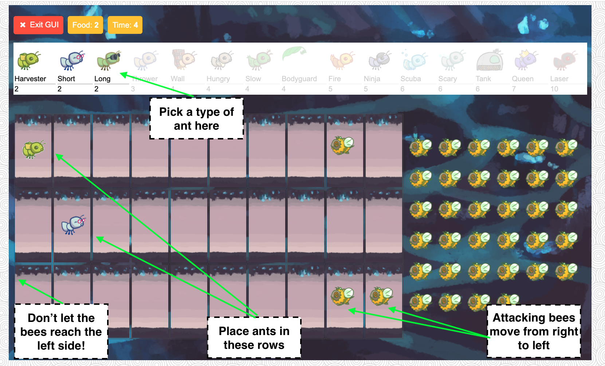

# Ants Vs. SomeBees

## How to play:
The Game
A game of Ants Vs. SomeBees consists of a series of turns. In each turn, new bees may enter the ant colony. 
Then, new ants are placed to defend their colony. Finally, all insects (ants, then bees) take individual actions. 
Bees either try to move toward the end of the tunnel or sting ants in their way. 
Ants perform a different action depending on their type, such as collecting more food or throwing leaves at the bees. 
The game ends either when a bee reaches the end of the tunnel (you lose), the bees destroy a QueenAnt if it exists (you lose), 
or the entire bee fleet has been vanquished (you win).



### Playing the game (game modes):
The game can be run in two modes: as a text-based game or using a graphical user interface (GUI). 
The game logic is the same in either case, but the GUI enforces a turn time limit that makes playing the game more exciting.

To start a text-based game, run
```python
python3 ants_text.py
```

To start a graphical game, run
```python
python3 gui.py
```
